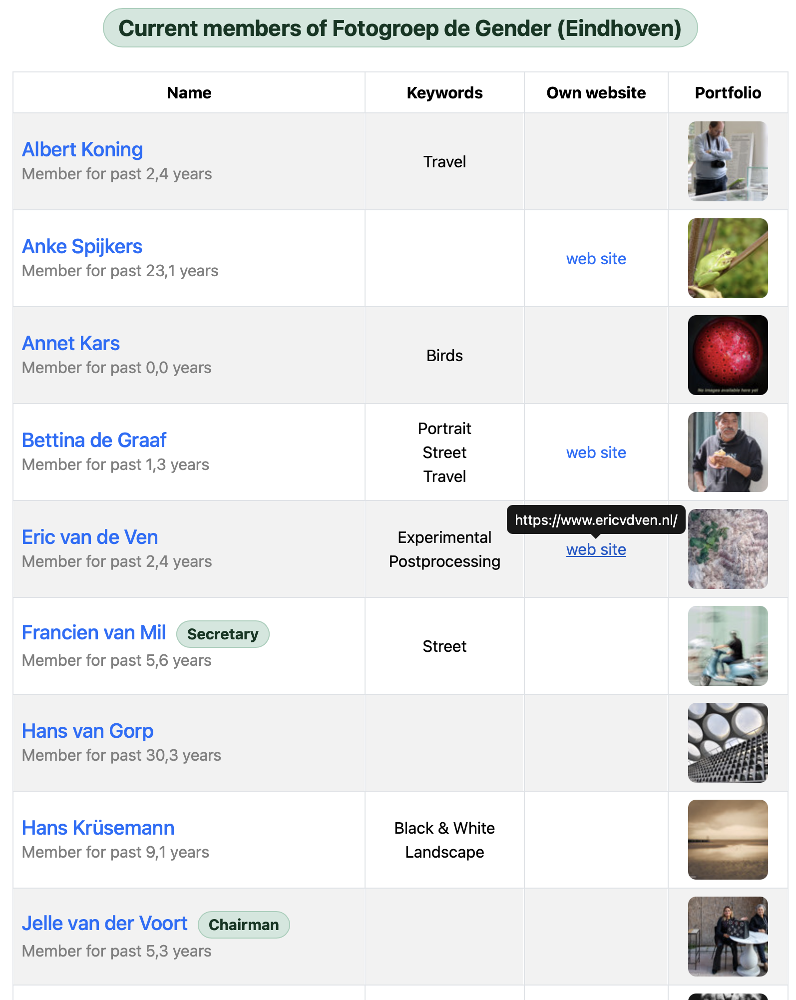

[![Version][stable-version]][version-url]
[![Contributors][contributors-shield]][contributors-url]
[![Forks][forks-shield]][forks-url]
[![Stargazers][stars-shield]][stars-url]
[![Issues][issues-shield]][issues-url]
[![Discussions][discussions-shield]][discussions-url]
[![MIT License][license-shield]][license-url]

# Photo-Club-Hub-HTML

This MacOS app is a companion to the iOS app [vdhamer/Photo-Club-Hub](https://github.com/vdhamer/Photo-Club-Hub).
The HTML app generates static websites using [twostraws/ignite](https://github.com/twostraws/ignite).
Both apps are for photo clubs that want to display curated work by their members online.

The input data driving these apps this forms a 3-level hierarchy: 

1. a central list with (dozens/hundreds/thousands? of) participating clubs,
2. local lists with (dozens of) members per club, and
3. local portfolios with (dozens of) selected images per member.

> The idea is to provide a _central_ portal to view images managed _locally_ by the individual clubs.
 
This concept is roughly comparable to the hierarchy of the distributed
[Domain Name System](https://en.wikipedia.org/wiki/Domain_Name_System) servers that translate address strings into numerical IP addresses: 
the app has one `root.level1.json` entrance that points the way to clubs which have optional `level2.json` membership lists.
These in turn optionally points to the image portfolios as managed by the clubs or even by the members themselves.

This MacOS app will (roadmap item) use the `root.level1.json` file to find a relevant `level2.json` file,
and (in contrast to the iOS app) convert the latter into a static website or subsite.
That website serves as an alternative option for users to view the images on devices running Android, Windows, MacOS, Linux, etc.

Inside the app's source code, the SwiftUI user interface framework is (read: will be) used and
CoreData is planned to temporarily store the retrieved data.

## Comparison to iOS app

TODO: add side-by-side comparison screenshots.

| Variant  | Photo Club Hub | Photo Club Hub HTML |
| ----------- | :-----------: | :-------: |
| Runs on | iOS, iPadOS, (MacOS) | all major browsers |
| Mobile friendly | yes | yes |
| List of clubs | yes | no* |
| List of club members | yes | yes |
| Member portfolios | yes | yes |
| Portfolio autoplay | yes | yes |
| Content updated | when club updates its data | when club updates its data |
| Maps showing clubs | yes | no |
| Photo musea listed | yes | no* |
| Search | yes | no |
| Supported languages | English, Dutch* | Dutch* |
| Can work offline | partly | no |

 * = _might be improved or supported in the future_

## Static sites and Ignite

This app runs on MacOS because it generates a local directory with a few files and a few subdirectories (CSS, Javascript, image assets).
These are then copied over to a club's existing server via e.g. FTP or possibly a Wordpress plug-in.
Technically the files simply need to be hosted on an HTTP server.

The data being displayed on the individual HTML sites may get updated say 10 times per year.
Because the update frequency is relatively low, and because the owners of the data are assumed to have limited "computer" expertise,
it is best to generate _static_ web sites. 
This limits the technical hasstle to uploading a file to a directory and associated useername/password.
This should be easier and more robust than having a backend that dynamically generates a site on demand.

**Ignite** allows us to create a tool in pure Swift 
that generates the content of the static website without having to code HTML/CSS/Javascript.
Swift is essentially a declarative higher-level description (`Result Builder`) that resembles data more than it resembles code.

## Why separate repo's?

From a purely technical perspective, Photo Club Hub and Photo Club HTML _could_ have been implemented as a single repository with
two relatively different targets that happen to be on two different platforms.

Despite having code overlap, they are - for now - split into two repos to lower the barrier to contribute to either.
Until the common code is factored out into a package, it will require some extra effort to keep the two in sync.

## Will 3 hierarchy levels be enough?

Initially there are only a handful of pilot clubs involved. 
A hundred clubs at <1 kB each can be supported with a single file, especially when loaded in the background.

To split up the `level1.json` file we _could_ allow the `root.level1.json` file to contain URL links to additional level1.json files.
This could, for example, allow the root file to support a path like `root/Netherlands` or `root/Japan/Tokio`.
This would allow a user to choose whether or not to load data for particular branches in the tree.

Such extra level(s) of hierarchy should match the way the data and responsibilities are organized: 
essentially the tree structure forms a chain of trust. 
A "rogue" or just non-club site will only be reachable if there is a chain of valid links between the default root and that site.
Thus a site with questionable content (say `my cat photos`) can thus be isolated by breaking one of the links.
But it would conceivably still be reachable from an alternative URL (path like cats_and_more_cats/Berlin).

## Roadmap

- [x] Fix the code (PR to twostraws/Ignite) so that the rendering works when Ignite is added as a regular Swift package.
- [ ] Load the membership list from a .level2.json file. Currently the app contains a copy of some of the data.
- [ ] provide a UI by which the user can select a club for which to generate a local site.
- [ ] localize the UI to support English (EN) and Dutch (NL),
- [ ] possibly generate a static site that can serve as index of supported clubs.
- [ ] possibly create one or more editor apps for managing the content in the JSON files

(<a href="#top">back to top</a>)

<!-- MARKDOWN LINKS & IMAGES -->
<!-- https://www.markdownguide.org/basic-syntax/#reference-style-links -->
[stable-version]: https://img.shields.io/github/v/release/vdhamer/Photo-Club-Hub-HTML?style=plastic&color=violet
[version-url]: https://github.com/vdhamer/Photo-Club-Hub-HTML/releases

[contributors-shield]: https://img.shields.io/github/contributors/vdhamer/Photo-Club-Hub-HTML?style=plastic
[contributors-url]: https://github.com/vdhamer/Photo-Club-Hub-HTML/graphs/contributors

[forks-shield]: https://img.shields.io/github/forks/vdhamer/Photo-Club-Hub-HTML?style=plastic&color=teal
[forks-url]: https://github.com/vdhamer/Photo-Club-Hub-HTML/network/members

[stars-shield]: https://img.shields.io/github/stars/vdhamer/Photo-Club-Hub-HTML?style=plastic
[stars-url]: https://github.com/vdhamer/Photo-Club-Hub-HTML/stargazers

[issues-shield]: https://img.shields.io/github/issues/vdhamer/Photo-Club-Hub-HTML?style=plastic
[issues-url]: https://github.com/vdhamer/Photo-Club-Hub-HTML/issues

[discussions-shield]: https://img.shields.io/github/discussions/vdhamer/Photo-Club-Hub-HTML?style=plastic&color=orange
[discussions-url]: https://github.com/vdhamer/Photo-Club-Hub-HTML/discussions

[license-shield]: https://img.shields.io/github/license/vdhamer/Photo-Club-Hub?style=plastic 
[license-url]: https://github.com/vdhamer/Photo-Club-Hub-HTML/blob/main/.github/LICENSE.md
