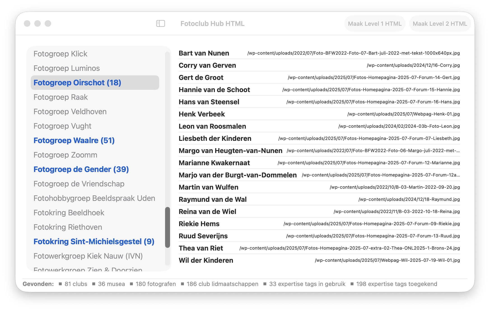

[![Version][stable-version]][version-url]
[![Contributors][contributors-shield]][contributors-url]
[![Forks][forks-shield]][forks-url]
[![Stargazers][stars-shield]][stars-url]
[![Issues][issues-shield]][issues-url]
[![Discussions][discussions-shield]][discussions-url]
[![MIT License][license-shield]][license-url]

# Photo-Club-Hub-HTML

This MacOS app generates static websites using [twostraws/ignite](https://github.com/twostraws/ignite).
It is a companion to the [vdhamer/Photo-Club-Hub](https://github.com/vdhamer/Photo-Club-Hub) iOS/iPadOS app.
Both apps allow photography clubs to display photos made by club members.

> The idea behind both apps is to provide a _central_ portal to view images that are managed _locally_ by the individual clubs.

This involves using a 3-level data hierarchy: 

1. a central list with (someday hundreds of) participating clubs,
2. local lists, each containing dozens of members per club, and
3. local portfolios with dozens of selected images per club member.

The [iOS app](https://github.com/vdhamer/Photo-Club-Hub) thus reads the various types of JSON data files
and uses these to drive the user interface on an iOS phone or tables.
This MacOS app reads the same JSON data files and converts them into HTML pages,
which can be viewed and traversed using a browser on almost any platform (Android, Windows, MacOS, etc.). 
The HTML pages can be stored on an existing (e.g. Wordpress) website and can be accessed via a link.

Because the HTML pages are static, this app needs to be rerun whenever the displayed data needs updating. 

## Running the app

Clicking on the "fire" icon generates the website. There is no proper feedback to the user yet.
The path to the directory with the new site will resemble `/Users/peter/Library/Containers/com.vdHamer.Photo-Club-Hub-HTML/Data/Build`.
You can use an FTP client like `Filezilla` to copy `Build` with its subdirectories to your HTTP server (e.g. a WordPress site).

## Comparing both apps

This website generator serves as an alternative for the `Photo Club Hub` iOS app: 
it allows users to view the images on devices running Android, Windows, MacOS, etc.

| | Photo Club Hub | Photo Club Hub HTML |
| ----------- | :-----------: | :-------: |
| Runs on | iOS, iPadOS, (MacOS, VisionOS) | all major browsers |
| Mobile friendly | yes | yes |
| Lists clubs | yes | -✲ |
| Lists photo museums | yes | -✲ |
| Lists current club members | yes | yes |
| Lists former club members | yes | yes |
| Displays member portfolios | yes | yes |
| Linkable member portfolios | - | yes |
| Portfolio autoplay | yes | yes |
| Content updated | whenever club updates its data | whenever club updates its data |
| Maps showing clubs | yes | - |
| Languages | English, Dutch✲ | English, Dutch✲ |
| Data caching | partiall✲ | partially✲ |
| Concurrent networking | yes | yes |
| Available via | App Store, GitHub | URL, GitHub |

 ✲ = _might be improved or supported in the future_

## Technology stack

| Technology           | Description                 |
| -------------------- | --------------------------- |
| [twostraws/Ignite](https://github.com/twostraws/ignite.git) | static website generator |
| [SwiftUI](https://developer.apple.com/documentation/coredata) | UI framework |
| [Core Data](https://developer.apple.com/documentation/coredata) | data storage framework |
| [SwiftyJSON/SwifyJSON](https://github.com/SwiftyJSON/SwiftyJSON.git) | JSON parsing |            

## Static sites and Ignite

This app runs on MacOS and generates a local directory with a few files and subdirectories (CSS, Javascript, image assets).
These are then copied over to a club's existing server via e.g. FTP.
Technically the files simply need to be hosted on an HTTP server such as a club's existing WordPress site.

The data being displayed on the individual HTML sites can get updated say 10 times per year.
Because the update frequency is relatively low, and because the owners of the data are assumed to have limited "computer" expertise,
it is best to generate _static_ web sites.
This limits the hasstle to uploading a file to a directory and associated username/password.
This should be easier and more robust than having custom server software that generates web pages on demand.

**Ignite** allows us to create a tool in pure Swift 
that generates the content of the static website without having to code HTML/CSS/Javascript.
Swift is essentially a declarative higher-level description (`Result Builder`) that resembles data more than it resembles code.

## Why separate repo's?

From a purely technical perspective, Photo Club Hub and Photo Club HTML _could_ have been implemented as a single repository with
two relatively different targets that happen to be on two different platforms.

Despite having code overlap, they are - for now - split into two repos to lower the barrier to contribute to either.
Until the common code is factored out into a package, it will require some extra effort to keep the two in sync.

## Will 3 hierarchy levels be enough?

Initially there are only a handful of pilot clubs involved. 
A hundred clubs at <1 kB each can be supported with a single `Level 1` file, especially when loaded in the background.

To split up the `level1.json` file we _could_ allow the `root.level1.json` file to contain URL links to additional level1.json files.
This could, for example, allow the root file to support a path like `root/Netherlands` or `root/Japan/Tokio`.
This would allow a user to choose whether or not to load data for particular branches in the tree.

Such extra level(s) of hierarchy should match the way the data and responsibilities are organized: 
essentially the tree structure forms a chain of trust. 
A "rogue" or just non-club site will only be reachable if there is a chain of valid links between the default root and that site.
Thus a site with questionable content (say `my cat photos`) can thus be isolated by removing a link.
But it would still be reachable using its URL (path like `cats_and_more_cats/Berlin`).
This is not a problem as long as hierarchy has a single root note and a single patch to any other node. 
Conceivably both apps could someday allow an alternative root node to be selected for non-photo-club usages.
For now this is only possible by a minor change to the source code.

## Roadmap

- [ ] Fix the Ignite code (accepted PR for twostraws/Ignite) so that Ignite can be imported as a regular Swift package.
- [x] Load the membership list from a .level2.json file. Currently the app contains a hardcoded partial copy of this data.
- [x] localize the generated website to support multiple languages (initially English and Dutch).
- [x] localize the app's UI to support English and Dutch (for now there isn't too much of a UI).
- [ ] generate a static site that can serve as index of supported clubs (Level 1 data, currently hardcoded).
   - [ ] allow the user to select the club for which to generate the local site (currently hardcoded constant).
- [ ] in general, all enhancements to the Photo Club Hub app are potential extensions to this app. 
   - [x] support for the (new, `Level 0`) data that allows photographers to be associated with keywords.

It would be nice to have an app for data enty/editing (rather than editing JSON files), but these would be a separate repo.

(<a href="#top">back to top</a>)

<!-- MARKDOWN LINKS & IMAGES -->
<!-- https://www.markdownguide.org/basic-syntax/#reference-style-links -->
[stable-version]: https://img.shields.io/github/v/release/vdhamer/Photo-Club-Hub-HTML?style=plastic&color=violet
[version-url]: https://github.com/vdhamer/Photo-Club-Hub-HTML/releases

[contributors-shield]: https://img.shields.io/github/contributors/vdhamer/Photo-Club-Hub-HTML?style=plastic
[contributors-url]: https://github.com/vdhamer/Photo-Club-Hub-HTML/graphs/contributors

[forks-shield]: https://img.shields.io/github/forks/vdhamer/Photo-Club-Hub-HTML?style=plastic&color=teal
[forks-url]: https://github.com/vdhamer/Photo-Club-Hub-HTML/network/members

[stars-shield]: https://img.shields.io/github/stars/vdhamer/Photo-Club-Hub-HTML?style=plastic
[stars-url]: https://github.com/vdhamer/Photo-Club-Hub-HTML/stargazers

[issues-shield]: https://img.shields.io/github/issues/vdhamer/Photo-Club-Hub-HTML?style=plastic
[issues-url]: https://github.com/vdhamer/Photo-Club-Hub-HTML/issues

[discussions-shield]: https://img.shields.io/github/discussions/vdhamer/Photo-Club-Hub-HTML?style=plastic&color=orange
[discussions-url]: https://github.com/vdhamer/Photo-Club-Hub-HTML/discussions

[license-shield]: https://img.shields.io/github/license/vdhamer/Photo-Club-Hub?style=plastic 
[license-url]: https://github.com/vdhamer/Photo-Club-Hub-HTML/blob/main/.github/LICENSE.md
